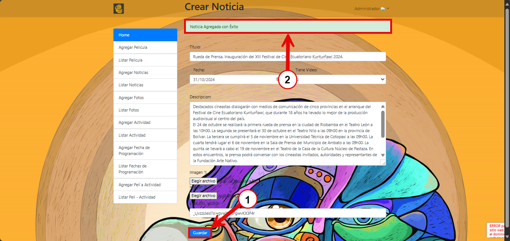

## CREAR NOTICIAS

1. Para crear noticias es necesario dar clic en la opción "Agregar noticias" del menú de la página de administrador como se muestra en la siguiente imagen

2. Llenar los datos del formulario, en el campo "Título", ingresa el título de la noticia

3. En el campo "Fecha", haz clic en el ícono del calendario al lado del campo para abrir el selector de fechas.
Selecciona la fecha en que deseas que se publique la noticia o la fecha relevante al evento.
Verifica que la fecha ingresada es la correcta antes de continuar con el resto del formulario.

4. Haz clic en el menú desplegable "Tiene Video" para ver las opciones.
Selecciona "Sí" si la noticia incluye un video o "No" si no tiene un video asociado.

5. En el campo "Descripción", escribe la descripción detallada de la noticia. Esta descripción debe proporcionar toda la información relevante y específica sobre el evento o tema de la noticia.

6.  En el campo "Imagen 1" o "Imagen 2", selecciona el botón Elegir archivo para abrir el explorador de archivos. Navega por las carpetas de tu dispositivo para encontrar la imagen que deseas cargar.
Haz clic en la imagen para seleccionarla. Una vez seleccionada la imagen, haz clic en el botón Abrir para confirmar la selección y cargar la imagen en el formulario.
Repite el proceso en el campo Imagen 2 si deseas agregar una segunda imagen.

7. En el campo "Link del Video", es necesario ingresar el codigo de un video de Youtube. Abre el video en YouTube que deseas agregar y haz clic en el botón de "Compartir" que aparece debajo del video 
En el cuadro de diálogo de compartir, copia solo el identificador del video, el codigo del video es la parte que aparece después del último /.
Regresa a tu formulario de administración en la sección "LINK DEL VIDEO" y pega el enlace copiado (usando Ctrl + V o clic derecho > pegar) en el campo correspondiente.

8. Para guardar la noticia, haz clic en el botón "Guardar". Una vez guardado, asegúrate de ver el mensaje "Noticia Agregada con Éxito" en la parte superior lo cual confirma que la información fue registrada correctamente.

## LISTAR NOTICIAS

1. Para editar o eliminar las noticias es necesario dar clic en la opción "Listar noticias" del menú de la página de administrador. Esto te llevará a la vista de todas las noticias que has agregado como se muestra en la siguiente imagen

2. Si se desea editar la noticia, en la lista de noticias, en la columna "Acciones" haz clic en el botón "Editar" de la sección de "Acciones" correspondiente a la noticia que deseas editar.

 

 3. Realiza la edición de los campo necesarios, una vez realizado la edición haz clic en la opción "Guardar". Una vez guardado, asegúrate de ver el mensaje "Noticia Modificada con Éxito" en la parte superior lo cual confirma que la información fue modificada correctamente.

 
 
 4. Si se desea eliminar la noticia, Haz clic en la opción "Listar Noticias" del menú lateral. Esto te llevará a la vista de todas las noticias que has agregado. En la lista de noticias, en la columna "Acciones" haz clic en el botón "Borrar" correspondiente a la noticia que deseas eliminar.
 Aparecerá un cuadro de diálogo de confirmación con la pregunta "¿Desea Borrar?". Para proceder, haz clic en el botón Aceptar. Si decides no borrar la noticia, puedes hacer clic en el botón Cancelar en el cuadro de diálogo para anular la acción.
 Al confirmar o aceptar la eliminación, asegúrate de ver el mensaje "Noticia eliminada con Éxito", lo cual confirmará que la noticia fue eliminada satisfactoriamente.

  

  