## AGREGAR PELÍCULA A ACTIVIDAD
1. Para agregar películas a la actividad es necesario dar clic en la opción "Agregar Pelí a Actividad" del menú de la página de administrador como se muestra en la siguiente imagen

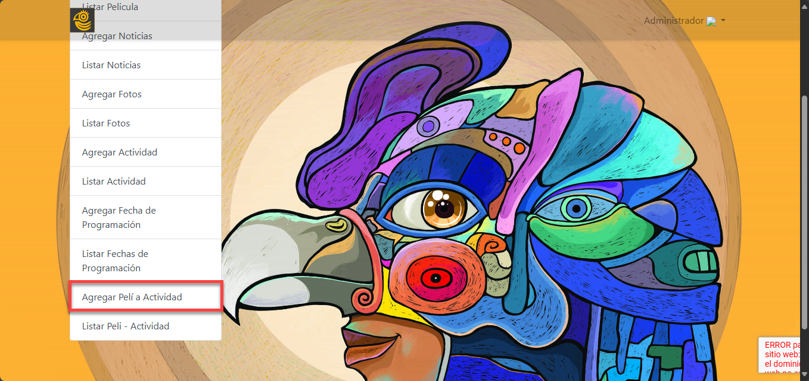

2. Para ingresar una película a una actividad, haga clic en el campo "Fecha" y despliegue la lista de actividades disponibles. Seleccione la actividad deseada haciendo clic en ella, asegurándose de elegir la fecha, hora y lugar correctos según el listado mostrado. Esto asociará la película con la actividad seleccionada.

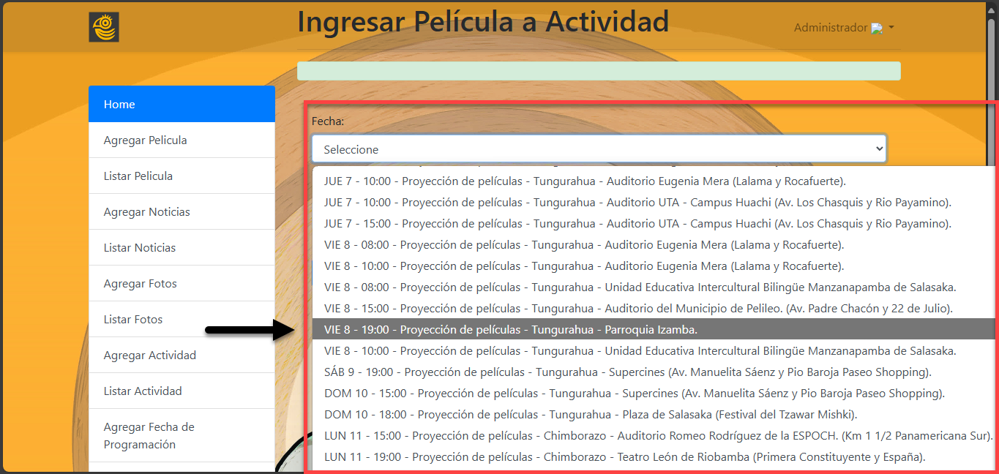

3. Para seleccionar una película, haga clic en el campo "Film" para desplegar la lista de películas disponibles. Luego, desplácese por el menú y haga clic en el título de la película que desea asociar a la actividad. Asegúrese de verificar su selección antes de continuar.

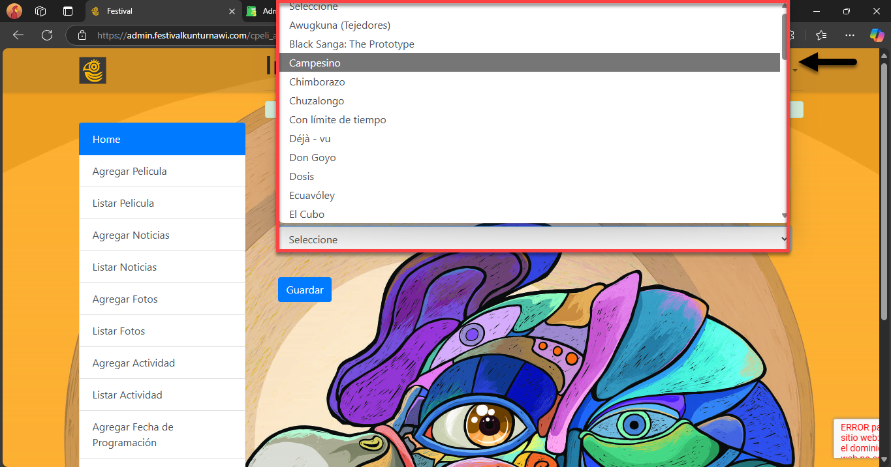

4. Haga clic en el botón "Guardar". Si la acción se realiza correctamente, aparecerá un mensaje en la parte superior indicando "Film Agregado a la Actividad", confirmando que la película se asoció exitosamente.

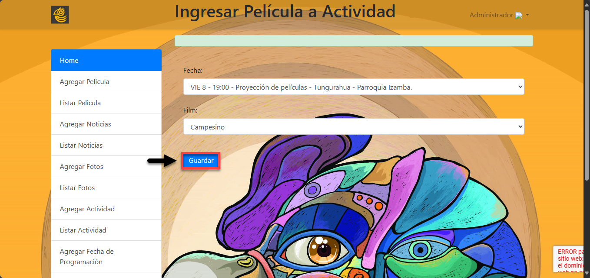

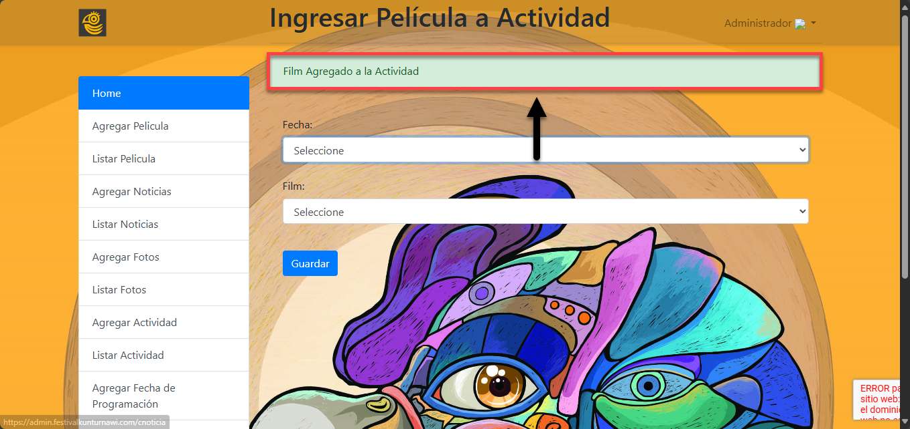

## LISTADO DE PROGRAMACIÓN

1. Para editar lo eliminar las películas de cada actividad es necesario dar clic en la opción "Listar Pelí-Actividad" del menú de la página de administrador como se muestra en la siguiente imagen y se mostrara el listado de programacion de las películas

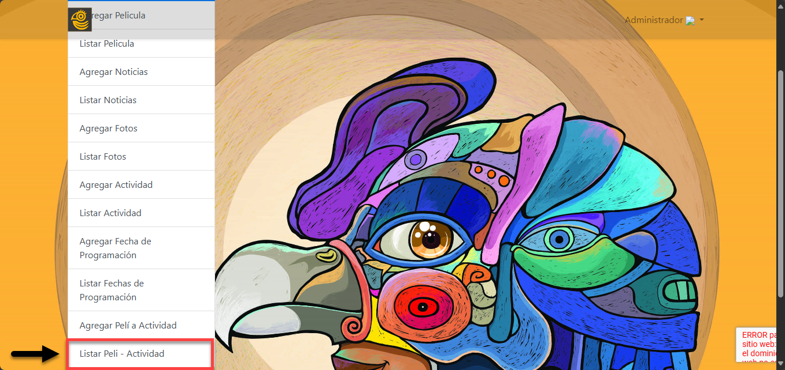

2. Para editar una programación en el listado, ubique el registro deseado en la tabla, identifíquelo en la columna "Acciones" y haga clic en el botón "Editar" correspondiente. Esto le permitirá modificar los detalles de la programación seleccionada.

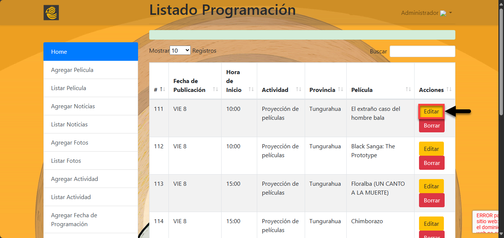

3. Una vez dentro del formulario de edición, verifique o modifique los campos necesarios, como la Fecha y el Film. Cuando haya realizado los ajustes necesarios, haga clic en el botón "Guardar" para registrar los cambios en la programación. Después de guardar los cambios en la programación, el sistema mostrará un mensaje en la parte superior indicando "Peli modificada en Actividad con Éxito", lo que confirma que los cambios realizados se han registrado correctamente. A continuación, puede continuar gestionando otras actividades o revisando el listado de programaciones.

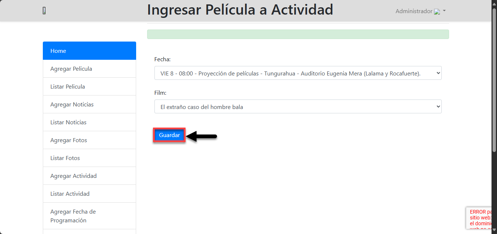

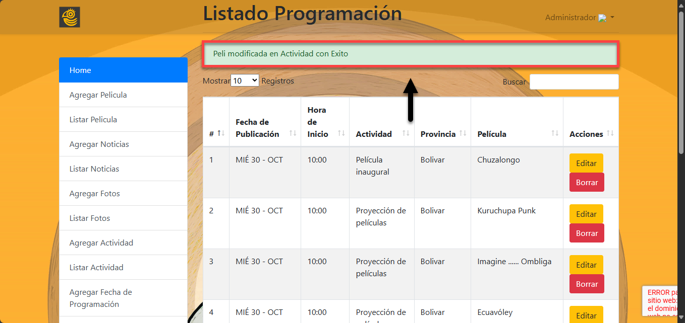

4. Para eliminar una película de la programación, haga clic en el botón "Borrar" correspondiente a la película que desea eliminar. A continuación, aparecerá un cuadro de diálogo solicitando confirmación para borrar. Haga clic en "Aceptar" para confirmar la eliminación o en "Cancelar" para detener el proceso.

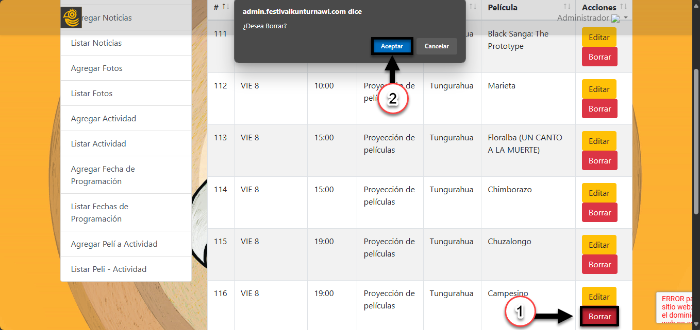

5. Después de confirmar la eliminación de una película, el sistema mostrará un mensaje en la parte superior que indica "Peli borrada de actividad con Éxito", confirmando que la película ha sido eliminada correctamente de la programación. 

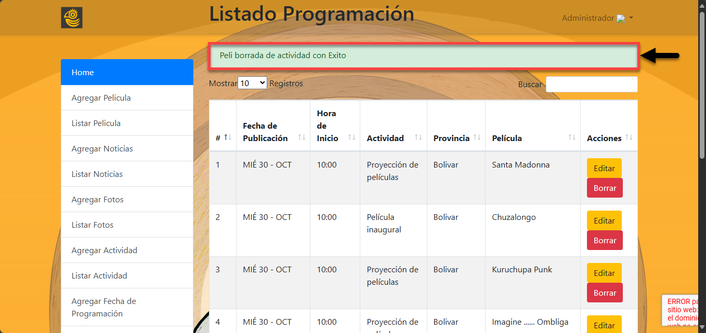