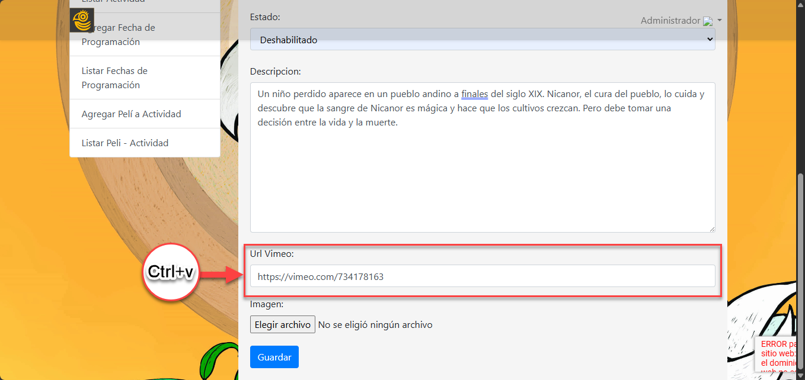

## INGRESAR PELÍCULA

1. Para ingresar película es necesario dar clic en la opción "Agregar Película" del menú de la página de administrador como se muestra en la siguiente imagen

2. En el campo "Título" Ingrese el nombre de la película

3. En el siguiente campo "Director/es" añade el nombre del o los directores de la película

4. En el campo "Año" Ingresa el año en que se estrenó la película

5. En el campo "Duración" Ingresa la el tiempo de la pelicula con el siguiente formato:
Para las Horas: Ingresa la cantidad de horas seguida de una comilla simple (')
Para los Minutos: Ingresa la cantidad de minutos seguida de una comilla ( '' )

6. En el campo "Ciudad", ingresa el nombre de la ciudad asociada con la película

7. En el campo "Categoría", selecciona el tipo de película de la lista desplegable según corresponda. Las opciones incluyen "Largometraje Ficción," "Largometraje Documental," "Cortometraje Ficción," "Cortometraje Documental," "Cortometraje Universitario Ficción," "Cortometraje Universitario Documental," y "Cortometraje Internacional." Asegúrate de elegir la categoría que mejor describe el contenido y formato de la película para una clasificación adecuada en el sistema.

8. En el campo "Estado", selecciona si deseas que la película esté "Habilitado" o "Deshabilitado" en el sistema. Si eliges "Habilitado", la película estará visible y disponible para los usuarios; si seleccionas "Deshabilitado", la película no será visible ni accesible para los usuarios.

9. En el campo "Descripción", proporciona una sinopsis o resumen de la trama de la película. Incluye detalles clave que ayuden a comprender el contexto, personajes principales y el conflicto central de la historia. Asegúrate de que la descripción sea clara, concisa y atractiva para captar el interés de los lectores.

10. En el campo Url Vimeo, ingresa el enlace directo al video de la película, copiándolo desde la plataforma Vimeo. Asegúrate de que el enlace sea correcto y esté completo, ya que permitirá que el video se visualice directamente en la página.

11. Para seleccionar una imagen para la película, sigue estos pasos: Haz clic en el botón Elegir archivo adjunto. En la ventana que se abre, navega hasta la ubicación donde tienes guardada la imagen y selecciona el archivo deseado. Una vez seleccionado el archivo, haz clic en Abrir para cargar la imagen al formulario.

12. Después de llenar todos los campos necesarios y seleccionar la imagen, haz clic en el botón Guardar para registrar la película. Si todos los datos son correctos, aparecerá un mensaje de confirmación en la parte superior de la pantalla, indicando "Film Agregado con Éxito". Este mensaje confirma que la película ha sido añadida correctamente a la base de datos del sistema Kunturñawi.

## LISTAR PELÍCULA

1. Para editar o eliminar las películas es necesario dar clic en la opción "Listar Película" del menú de la página de administrador. Esto te llevará a la vista de todas las películas que has agregado como se muestra en las siguientes imágenes

2. En la parte inferior de la lista de películas, encontrarás una barra de paginación que te permite navegar entre diferentes páginas del listado. Utiliza los botones de "Anterior" y "Siguiente" para desplazarte hacia la página anterior o siguiente, respectivamente. También puedes hacer clic en un número específico para ir directamente a esa página. Esto facilita la visualización y gestión de un gran número de películas al dividirlas en páginas más manejables.

3. Si se desea editar la película, en la lista de película, en la columna "Acciones" haz clic en el botón "Editar" de la sección de "Acciones" correspondiente a la pelicula que deseas editar.

4. Realiza la edición de los campo necesarios, una vez realizado la edición haz clic en la opción "Guardar". Una vez guardado, asegúrate de ver el mensaje "Película Modificada con Éxito" en la parte superior lo cual confirma que la información fue modificada correctamente.

5. Si desea eliminar da nuevamente clic en la opción "Listar Película" del menú de la página de administrador.
En la lista de películas, en la columna "Acciones" haz clic en el botón "Borrar" correspondiente a la película que deseas eliminar. Aparecerá un cuadro de diálogo de confirmación con la pregunta "¿Desea Borrar?". Para proceder, haz clic en el botón Aceptar. Si decides no borrar la película, puedes hacer clic en el botón Cancelar en el cuadro de diálogo para anular la acción. Al confirmar o aceptar la eliminación, asegúrate de ver el mensaje "Noticia eliminada con Éxito", lo cual confirmará que la noticia fue eliminada satisfactoriamente.

