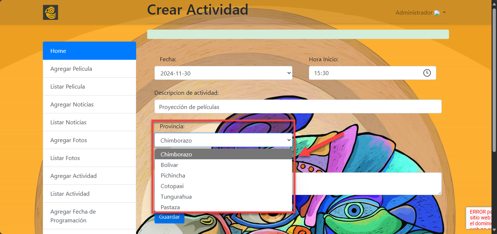

## AGREGAR ACTIVIDADES
1. Para agregar actividades para el calendario es necesario dar clic en la opción "Agregar Actividad" del menú de la página de administrador como se muestra en la siguiente imagen

2. Para seleccionar la fecha, haga clic en el menú desplegable del campo "Fecha", desplácese por la lista de opciones disponibles y haga clic en la fecha deseada para que se registre en el formulario.

3. Para seleccionar la hora de inicio, haga clic en el ícono de reloj junto al campo "Hora Inicio", elija la hora y los minutos deseados de las opciones desplegadas, y confirme que el horario seleccionado se visualice correctamente en el campo.

4. Para ingresar la descripción de la actividad, localice el campo "Descripción de actividad", haga clic dentro del cuadro de texto y escriba el detalle correspondiente, asegurándose de que sea claro y específico.

5. Para seleccionar la provincia, haga clic en el menú desplegable del campo "Provincia", desplácese por la lista de opciones disponibles y haga clic sobre la provincia correspondiente para que se registre en el formulario.

6. Para ingresar el lugar, haga clic dentro del campo "Lugar", escriba la ubicación específica donde se llevará a cabo la actividad, y asegúrese de detallar la dirección o referencia claramente antes de continuar, luego haga clic en el botón "Guardar" ubicado en la parte inferior del formulario para registrar la actividad.

7. Después de completar y guardar los datos en el formulario, aparecerá un mensaje en la parte superior indicando "Actividad Agregada con Éxito", lo cual confirma que la información se ha registrado correctamente en el sistema.

## LISTAR ACTIVIDADES
1. Para editar o eliminar las actividades del calendario es necesario dar clic en la opción "Listar Actividad" del menú de la página de administrador como se muestra en la siguiente imagen

2. Para editar una actividad registrada, ubique la actividad deseada en la lista y haga clic en el botón "Editar" en la columna de acciones correspondiente. Esto abrirá un formulario donde podrá modificar los datos de la actividad seleccionada. Asegúrese de guardar los cambios una vez realizados.

3. Para modificar una actividad, ajuste los campos necesarios en el formulario, como la Fecha, Hora Inicio, Descripción de actividad, Provincia o Lugar, y haga clic en el botón "Guardar" para registrar los cambios. Una vez guardados, aparecerá un mensaje en la parte superior indicando "Actividad Modificada con Éxito", confirmando que las actualizaciones se realizaron correctamente.

4. Si desea eliminar una actividad, haga clic en "Listar Actividad" del menú de la página de administrador. Esto desplegará la lista de actividades registradas. Luego, localice la actividad que desea eliminar y haga clic en el botón "Borrar" correspondiente.

5. Después de hacer clic en el botón "Borrar" para eliminar una actividad, aparecerá una ventana de confirmación con el mensaje "¿Desea borrar?". Para proceder con la eliminación, haga clic en el botón "Aceptar". Si desea cancelar la acción, haga clic en "Cancelar" para mantener la actividad registrada. Una vez confirmada la eliminación de la actividad, el sistema mostrará un mensaje en la parte superior de la pantalla indicando "Actividad borrada con Éxito". Esto confirma que la actividad seleccionada se ha eliminado correctamente de la lista.

