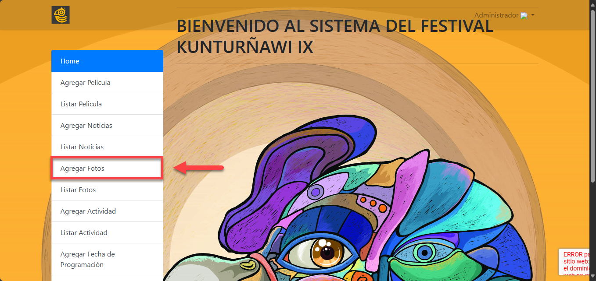
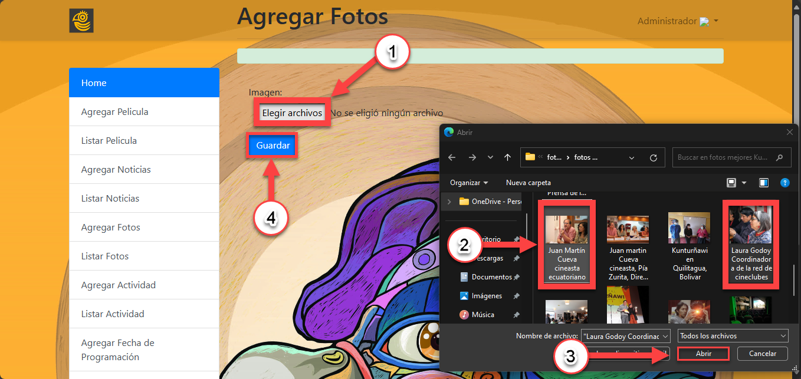
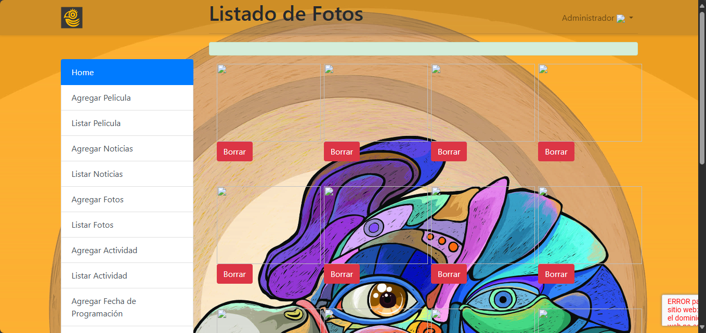
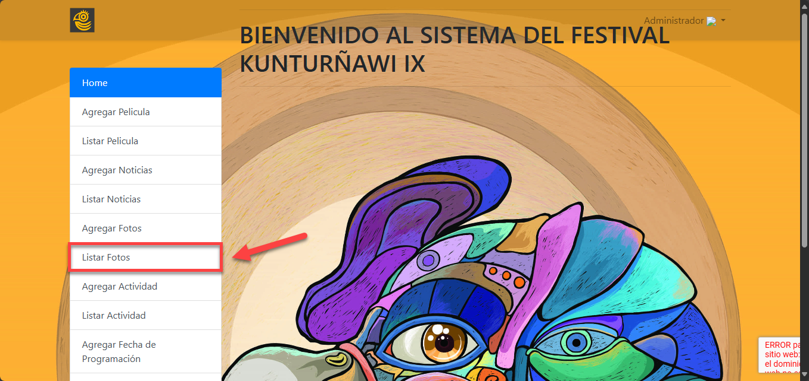
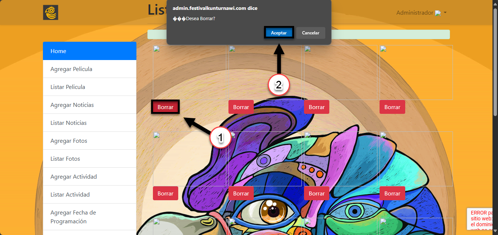

## AGREGAR FOTOS A GALERÍA
1. Para cargar imágenes para la sección de galería es necesario dar clic en la opción "Agregar Fotos" del menú de la página de administrador como se muestra en la siguiente imagen

2. Haz clic en el botón Elegir archivos. En la ventana que se abre, navega hasta la carpeta donde tienes almacenadas las fotos y selecciona múltiples imágenes manteniendo presionada la tecla Ctrl mientras haces clic en cada una. Una vez seleccionadas las imágenes, haz clic en Abrir para cargar las fotos en el formulario. Finalmente, haz clic en Guardar para registrar todas las fotos seleccionadas

3. Una vez hecho clic en "Guardar", nos redireccionará al listado de las imágenes o galería donde podremos visualizar las imágenes.

## LISTAR FOTOS

1. Para eliminar las fotos añadidas es necesario dar clic en la opción "Listar Fotos" del menú de la página de administrador. Esto te llevará a la vista de todas las fotos que has agregado como se muestra en las siguientes imágenes

2. Para eliminar una imagen de la galeria, haz clic en el botón Borrar. Aparecerá un mensaje de confirmación preguntando "¿Desea Borrar?". Si estás seguro de que deseas eliminar la imagen, haz clic en Aceptar para confirmar. Si cambias de opinión, selecciona Cancelar para mantener la imagen

3. Una vez eliminado la imagen, asegúrate de ver el mensaje "Foto Eliminada con Éxito", lo cual confirmará que la foto fue eliminada satisfactoriamente de la Galería.

